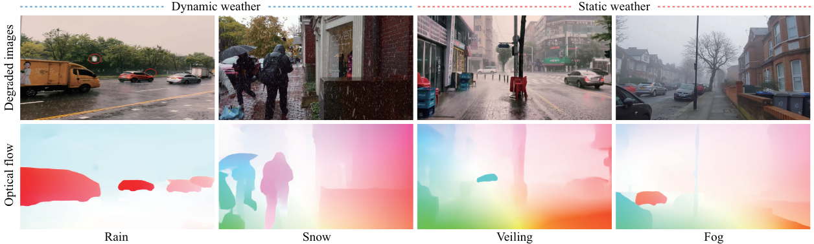
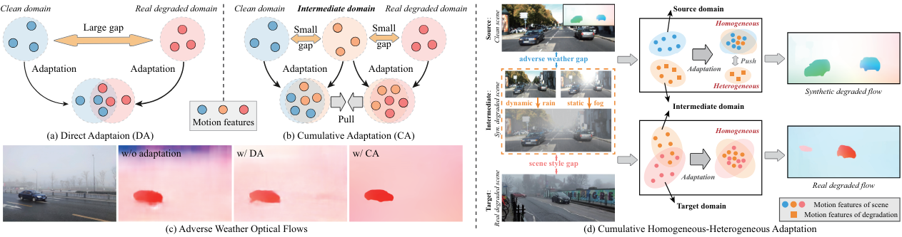
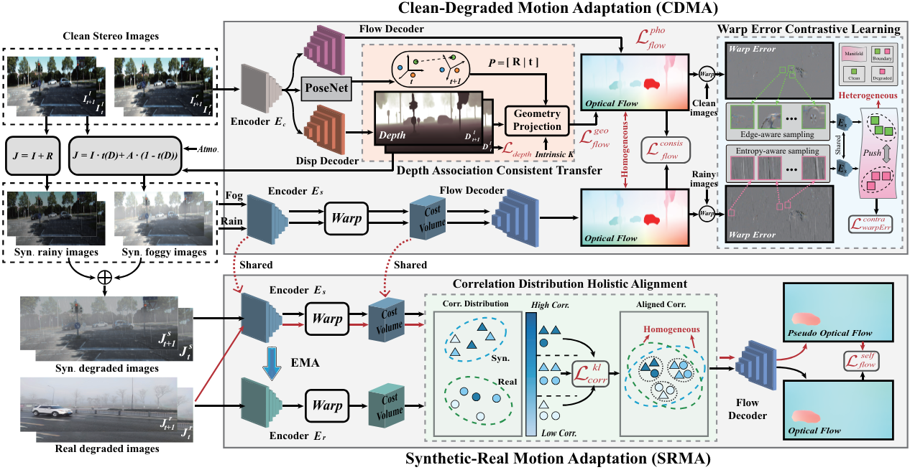
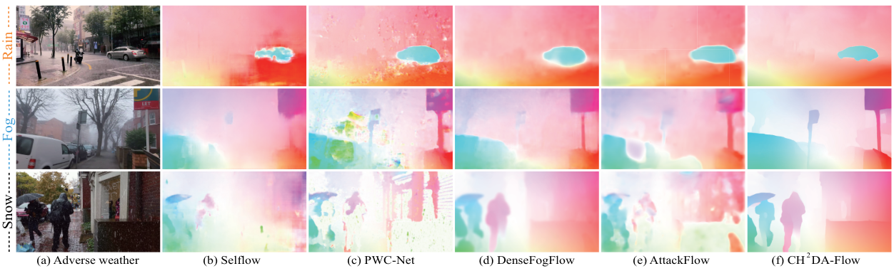

# Adverse Weather Optical Flow: Cumulative Homogeneous-Heterogeneous Adaptation

## TPAMI 2024

### [Paper](https://ieeexplore.ieee.org/document/10689387) | [arXiv](https://arxiv.org/pdf/2409.17001)

[Hanyu Zhou](https://hyzhouboy.github.io/) $^{1}$, [Yi Chang](https://owuchangyuo.github.io/) $^{1✉}$, [Zhiwei Shi](https://scholar.google.com/citations?user=lgiDifUAAAAJ&hl=zh-CN) $^{1}$, [Wending Yan](https://scholar.google.com/citations?hl=en&user=VoFRbrQAAAAJ&view_op=list_works&sortby=pubdate) $^{2}$, [Gang Chen](https://scholar.google.com/citations?user=7GwIDigAAAAJ&hl=zh-CN) $^{3}$, [Yonghong Tian](https://scholar.google.com/citations?user=fn6hJx0AAAAJ&hl=zh-CN) $^{4}$, [Luxin Yan](https://scholar.google.com/citations?user=5CS6T8AAAAAJ&hl=en) $^{1}$

$^1$ Huazhong University of Science and Technology

$^2$ Huawei International Co. Ltd.

$^3$ Sun Yat-sen University

$^4$ Peking University

$^✉$ Corresponding Author.



⭐**Our CH2DA-Flow makes success in optical flow estimation under different adverse weather conditions.**



⭐**Our CH2DA-Flow is a cumulative homogeneous-heterogeneous motion adaptation framework, which is an extension of** [UCDA-Flow](https://openaccess.thecvf.com/content/CVPR2023/papers/Zhou_Unsupervised_Cumulative_Domain_Adaptation_for_Foggy_Scene_Optical_Flow_CVPR_2023_paper.pdf).

## Framework



Our CH2DA-Flow framework consists of two components: clean-degradation and synthetic-real motion adaptation modules. The former transfers motion knowledge from clean domain to synthetic weather domain, while the latter transfers motion knowledge from synthetic weather domain to real weather domain. The whole framework is similar to [UCDA-Flow](https://openaccess.thecvf.com/content/CVPR2023/papers/Zhou_Unsupervised_Cumulative_Domain_Adaptation_for_Foggy_Scene_Optical_Flow_CVPR_2023_paper.pdf), while the key difference is warp error contrastive learning for dynamic weather flow adaptation.

## News

2026.1.4: Training and evaluation codes are released.

2025.4.25: Testing code and pre-trained models are released.

2024.9.18: Our paper is accepted by TPAMI 2024.

## Environmental Setups

```
git clone https://github.com/hyzhouboy/CH2DA-Flow.git
cd CH2DA-Flow
conda create -n CH2DA-Flow python=3.8
conda activate CH2DA-Flow

conda install pytorch=1.6.0 torchvision=0.7.0 cudatoolkit=10.1 matplotlib tensorboard scipy pillow opencv -c pytorch
pip install absl-py==0.8.0 astor==0.8.0 bleach==1.5.0 future==0.17.1 gast==0.2.2 google-pasta==0.1.7 grpcio==1.23.0 h5py==2.9.0 html5lib==0.9999999 keras-applications==1.0.8 keras-preprocessing==1.1.0 markdown==3.1.1 protobuf==3.9.1 tb-nightly==1.15.0a20190902 termcolor==1.1.0 werkzeug==0.15.5 wrapt==1.11.2
```

## Preparing Dataset

We first should prepare the pre-trained datasets, including clean images, synthetic foggy/rainy images and real foggy/rainy/snowy images. For the clean images, we can obtain them from Internet and open source datasets (*e.g.*, KITTI). For the synthetic data, we refer to the code from the tool.py file to generate the synthetic foggy images:

```
def gemerate_haze(rgb, depth, k, beta):
    # haze_k = k + 0.3 * np.random.rand() # 0.3
    haze_k = k + 0.3 # 0.3
    haze_beta = beta  #0.0001

    transmitmap = np.expand_dims(np.exp(-1 * haze_beta * depth), axis=2)

    tx = np.concatenate([transmitmap, transmitmap, transmitmap], axis=2)
    txcvt = (tx * 255).astype('uint8')
    
    # guided filter smooth the transmit map
    tx_filtered = cv2.ximgproc.guidedFilter(guide=rgb, src=txcvt, radius=50, eps=1e-3, dDepth=-1)

    fog_image = (rgb / 255) * tx_filtered/255 + haze_k * (1 - tx_filtered/255)
    # fog_image = (rgb / 255) + haze_k
    fog_image = np.clip(fog_image, 0, 1)
    # print(fog_image*255)
    fog_image = (fog_image * 255).astype('uint8')
    return fog_image
```

Moreover, we use the *Adobe Effect* software to simulate the rain streaks on clean images of KITTI for synthetic rainy images. Besides, we also need to self-collect the real weather images for training. Here, we choose the KITTI as clean version and use the above strategy to generate the corresponding synthetic foggy/rainy images. We also provide the real weather flow dataset *Real-Weather World*, including real foggy images [UCDA-Fog](https://drive.google.com/file/d/19niZjG_IvC0NZUDZ2ELVlt73BdvHHfdn/view?usp=sharing). Note that, we will provide more real rainy and snowy images with flow GTs in the future.

## Training

We divide the whole training into three stages (please refer to train.sh): initialization, clean-synthetic, synthetic-real transfer.

```
mkdir -p checkpoints
```

Stage 1-s1: Initialize flow and depth models of clean domain.

```
python -u main.py --data_dir /KITTI/data/data_scene_flow \
    --stage kitti_s1 --restore_flow_ckpt model/raft.pth --restore_disp_ckpt model/aanet.pth \
    --gpus 0 1 2 --num_steps 100000 --batch_size 16 --lr 0.0001 --image_size 288 960 --wdecay 0.00001 --gamma=0.85 --mixed_precision
```

Stage 1-s2: Introduce pose knowledge to optimize flow models of clean domain.

```
python -u main.py --data_dir /KITTI/data/data_scene_flow \
    --stage kitti_s2 --restore_flow_ckpt model/raft.pth --restore_disp_ckpt model/aanet.pth \
    --restore_pose_encoder_ckpt model/pose/pose_encoder.pth --restore_pose_decoder_ckpt model/pose/pose.pth \
    --gpus 0 1 --num_steps 100000 --batch_size 12 --lr 0.0001 --image_size 288 960 --wdecay 0.00001 --gamma=0.85 --mixed_precision
```

Stage 1-s3: Generate depths of clean images for subsequent motion knowledge transfer.

```
python -u main.py --data_dir /KITTI/data/data_scene_flow \
    --stage kitti_s3 --restore_flow_ckpt model/raft.pth --restore_disp_ckpt model/aanet.pth \
    --gpus 0 --num_steps 100000 --batch_size 1 --lr 0.0001 --image_size 375 1242 --wdecay 0.00001 --gamma=0.85 --mixed_precision
```

Stage 2-s1: Transfer motion knowledge from clean to synthetic foggy domain.

```
python -u main.py --data_dir /Your/Dataset \
    --stage kitti_foggy --restore_flow_ckpt model/raft.pth --restore_flow_synimg_ckpt model/raft_synfog.pth \
    --gpus 0 1 --num_steps 100000 --batch_size 8 --lr 0.00002 --image_size 288 960 --wdecay 0.00001 --gamma=0.85 --mixed_precision
```

Stage 2-s2: Transfer motion knowledge from clean to synthetic rainy domain.

```
python -u main.py --data_dir /Your/Dataset \
    --stage kitti_rain --restore_flow_ckpt model/raft.pth --restore_flow_synimg_rain_ckpt model/raft_synrain.pth \
    --gpus 0 1 --num_steps 100000 --batch_size 8 --lr 0.00001 --image_size 288 960 --wdecay 0.00001 --gamma=0.85 --use_contra_loss --mixed_precision
```

Stage 3-s1: Transfer motion knowledge from synthetic foggy domain to real weather domain.

```
python -u main.py --data_dir /Your/Dataset \
    --stage real_foggy --restore_flow_synimg_ckpt model/raft_synfog.pth --restore_flow_realimg_ckpt model/ch2da.pth \
    --gpus 0 --num_steps 100000 --batch_size 16 --lr 0.00001 --image_size 288 640 --wdecay 0.00001 --gamma=0.85 --mixed_precision
```

Stage 3-s2: Transfer motion knowledge from synthetic rainy domain to real weather domain.

```
python -u main.py --data_dir /Your/Dataset \
    --stage real_rain --restore_flow_synimg_ckpt model/raft_synrain.pth --restore_flow_realimg_ckpt model/ch2da.pth \
    --gpus 0 --num_steps 100000 --batch_size 16 --lr 0.00001 --image_size 288 640 --wdecay 0.00001 --gamma=0.85 --mixed_precision
```

Note that `--use_context_attention` and `--use_contra_loss` are optional terms. Here we provide the trained model files [CH2DA-Flow model](https://drive.google.com/file/d/1piMFSdjTw8DxmaZaPRK9bRNEKEoGfW2p/view?usp=sharing).

## Evaluation

You can evaluate a trained model using *evaluate.py*:

```
python -u evaluate.py --model model/ch2da.pth --dataset Your_Dataset --path /path/Your_Dataset --mixed_precision
```

## Testing

After training or obtaing the trained CH2DA-Flow model, we can perform the inference code (please refer to demo.py):

```
python -u demo.py --model model/ch2da.pth --path /path/your_weather_images --mixed_precision
```



## (Optional) Efficient Implementation

You can optionally use our alternate (efficent) implementation by compiling the provided cuda extension:

```
cd alt_cuda_corr
python setup.py install
cd ..
```

and running *demo.py* and *evaluation.py* with the `--alternate_corr` flag Note, which improves the inference efficiency.

## TO DO

```
[x] Releasing Testing code and pre-trained models.
[x] Releasing evaluation code.
[x] Releasing parts of self-collected real weather datasets.
[x] Releasing training code.
[ ] Provide more real weather datasets, including rain and snow.
```

## Citation

If you find this repository/work helpful in your research, welcome to cite the two papers and give a ⭐.

```
@inproceedings{zhou2023unsupervised,
  title={Unsupervised cumulative domain adaptation for foggy scene optical flow},
  author={Zhou, Hanyu and Chang, Yi and Yan, Wending and Yan, Luxin},
  booktitle={Proceedings of the IEEE/CVF conference on computer vision and pattern recognition},
  pages={9569--9578},
  year={2023}
}
```

```
@article{zhou2024adverse,
  title={Adverse weather optical flow: Cumulative homogeneous-heterogeneous adaptation},
  author={Zhou, Hanyu and Chang, Yi and Shi, Zhiwei and Yan, Wending and Chen, Gang and Tian, Yonghong and Yan, Luxin},
  journal={IEEE Transactions on Pattern Analysis and Machine Intelligence},
  year={2024},
  publisher={IEEE}
}
```
